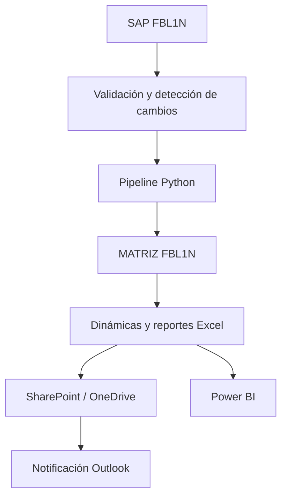

# Operations Analytics — Automatización de Procesos SAP

Proyecto Capstone 2026 de Ingeniería en Informática, Duoc UC, sede Alameda.

> **Inicio del proyecto:** 13 de julio de 2026
> **Estado técnico:** solución funcional y en operación controlada
> **Estado académico al 10 de septiembre de 2026:** Fase 2, semana 9

## Descripción

Operations Analytics es una plataforma de automatización y analítica orientada al proceso SAP FBL1N. La solución obtiene y valida información de compensaciones, consolida las fuentes histórica y vigente, construye una matriz analítica, genera reportes y tablas dinámicas en Excel, publica los resultados en SharePoint/OneDrive y notifica su disponibilidad mediante correo corporativo.

Está dirigida al equipo de Back Office y Operaciones Comerciales. Su propósito es reducir tareas manuales repetitivas, tiempos de procesamiento, riesgo de errores y dependencia de consolidaciones realizadas individualmente en Excel.

## Funcionalidades principales

- Extracción controlada de FBL1N mediante SAP GUI Scripting.
- Validación estructural y semántica de los archivos de entrada.
- Detección de cambios para evitar reprocesamientos innecesarios.
- Consolidación de información histórica y vigente según la fecha de compensación.
- Generación automática de `MATRIZ_FBL1N`.
- Construcción y actualización de reportes y tablas dinámicas de Excel.
- Publicación de archivos en una carpeta corporativa de SharePoint sincronizada con OneDrive.
- Notificación automática mediante Outlook únicamente cuando corresponde.
- Registro de estados, trazabilidad, respaldos, logs y bloqueos de concurrencia.
- Ejecución programada de lunes a viernes.

## Tecnologías utilizadas

| Área | Tecnologías |
|---|---|
| Lenguajes | Python 3.13, PowerShell, VBScript, TypeScript |
| Procesamiento | pandas, NumPy, openpyxl, python-calamine, PyYAML |
| Automatización Windows | pywin32, Excel COM, Outlook COM, Windows Task Scheduler |
| Backend | FastAPI, Uvicorn, Pydantic |
| Frontend | React, TypeScript, Vite |
| Plataforma empresarial | SAP GUI, Excel, Outlook |
| Cloud y colaboración | Microsoft SharePoint, OneDrive, Power BI |
| Control de versiones | Git y GitHub |
| Persistencia | Archivos Excel y estados JSON; no utiliza una base de datos relacional |

## Arquitectura de la solución

La solución utiliza una arquitectura modular basada en pipeline. Cada etapa tiene validaciones y genera evidencia antes de entregar el resultado a la siguiente.



### Capas principales

1. **Adquisición:** obtiene las fuentes SAP e históricas.
2. **Validación:** comprueba estabilidad, estructura, columnas, fechas e integridad.
3. **Procesamiento:** limpia, clasifica, consolida y calcula la información.
4. **Presentación:** genera la matriz y los reportes dinámicos.
5. **Publicación:** actualiza los archivos compartidos.
6. **Notificación:** informa la disponibilidad del reporte.
7. **Control:** conserva estados, logs, respaldos y mecanismos anti-duplicación.

## Estructura general

```text
automatizacion_procesos_sap/
├── assets/                 # Recursos visuales autorizados
├── docs/                   # Arquitectura y documentación Capstone
├── scripts/                # Entradas de ejecución y utilidades
├── src/                    # Código fuente modular
├── tests/                  # Pruebas automatizadas
├── ui/                     # Interfaz web
├── .env.example            # Plantilla de configuración sin secretos
├── .gitignore              # Exclusión de archivos locales y sensibles
├── config.yml              # Configuración general sin credenciales
├── requirements.txt        # Dependencias Python
└── README.md               # Presentación principal del proyecto
```

## Requisitos para ejecución local

- Windows 11.
- Python 3.13 de 64 bits.
- Git.
- Microsoft Excel y Outlook instalados.
- SAP GUI con Scripting habilitado y acceso autorizado.
- Acceso autorizado a SharePoint/OneDrive.

> El repositorio no contiene credenciales, datos productivos, archivos SAP reales ni rutas personales. La ejecución empresarial completa requiere accesos corporativos autorizados.

## Instalación local

1. Clonar el repositorio:

   ```powershell
   git clone https://github.com/TaniaCamila/automatizacion_procesos_sap.git
   Set-Location automatizacion_procesos_sap
   ```

2. Crear el entorno virtual:

   ```powershell
   py -3.13 -m venv .venv
   ```

3. Instalar las dependencias:

   ```powershell
   & '.\.venv\Scripts\python.exe' -m pip install -r requirements.txt
   ```

4. Crear la configuración local:

   ```powershell
   Copy-Item '.env.example' '.env'
   ```

5. Completar `.env` con rutas y parámetros autorizados. Nunca se deben publicar contraseñas, tokens ni información productiva.

6. Ejecutar primero una detección controlada:

   ```powershell
   & '.\.venv\Scripts\python.exe' 'scripts\run_actualizacion_automatica.py' --detect-only
   ```

7. Ejecutar las pruebas automatizadas:

   ```powershell
   & '.\.venv\Scripts\python.exe' -m pytest
   ```

La ejecución productiva solo debe realizarse en un entorno autorizado y después de superar las validaciones correspondientes.

## Operación diaria controlada

El script `scripts/run_diario.py` es el **wrapper de ejecución diaria**: orquesta la extracción SAP (VBS), valida el archivo futuro, libera bloqueos de Excel cuando corresponde y lanza el pipeline sin `--force`.

Simulación segura (solo lectura; no ejecuta VBS, pipeline ni correo; no modifica el archivo productivo):

```powershell
.\.venv\Scripts\python.exe scripts\run_diario.py --simulate-vbs
```

Ejecución real controlada (requiere sesión interactiva de Windows con SAP GUI, Excel COM y Outlook COM disponibles según configuración):

```powershell
.\.venv\Scripts\python.exe scripts\run_diario.py
```

Registro de la tarea programada de Windows (lun–vie 09:00; usar ruta genérica del proyecto):

```powershell
powershell -ExecutionPolicy Bypass -File scripts\instalar_tarea_diaria.ps1 -ProjectRoot C:\Ruta\Proyecto
```

Notas operativas:

- La tarea se configura de **lunes a viernes a las 09:00** (hora local del equipo).
- El correo automático se restringe al **viernes** mediante `MAIL_SEND_WEEKDAY=4` en `.env`.
- El corte de compensación puede derivarse de la máxima fecha presente en la fuente con `FBL1N_COMPENSATION_CUTOFF_MODE=max_source_date`.
- SAP GUI, Excel COM y Outlook COM requieren una **sesión interactiva** de Windows (equipo desbloqueado).
- La simulación (`--simulate-vbs`) **no** ejecuta VBS, pipeline ni correo y **no** modifica el archivo productivo.
- En documentación y ejemplos se usan únicamente rutas genéricas (`C:\Ruta\Proyecto`, `C:\Ruta\Entrada`, `C:\Ruta\Salida`).

## Integrantes y roles

| Integrante | Rol |
|---|---|
| Tania Herrera | Líder técnica, desarrolladora principal, automatización, integración y despliegue |
| Camila Armijo | Analista funcional, documentación, validación y apoyo de QA |

## Metodología de trabajo

El equipo utiliza un enfoque híbrido de **Kanban y DevOps**, con desarrollo iterativo e incremental.

- Las actividades se organizan por prioridad y estado.
- Cada funcionalidad se implementa en incrementos verificables.
- Se aplican pruebas antes de integrar cambios.
- Git y GitHub mantienen trazabilidad y control de versiones.
- Los despliegues se realizan de forma controlada, con respaldos y validaciones.
- Los estados y logs permiten auditar cada ejecución.
- La retroalimentación de usuarios se incorpora en iteraciones posteriores.

## Cronología del proyecto

| Periodo | Semana Capstone | Avance |
|---|---:|---|
| 13–19 julio 2026 | 1 | Inicio, levantamiento del problema y definición del alcance |
| 20 julio–9 agosto 2026 | 2–4 | Requisitos, arquitectura, fuentes y primera versión del pipeline |
| 10–30 agosto 2026 | 5–7 | Desarrollo modular, matriz, dinámicas, publicación y validaciones |
| 31 agosto–6 septiembre 2026 | 8 | Despliegue controlado, estados, correo y pruebas operativas |
| 7–13 septiembre 2026 | 9 | Programación diaria, continuidad operativa y evaluación de migración a GREPORTS |

Las actividades posteriores se incorporarán cuando hayan sido efectivamente desarrolladas y validadas. No se modifican ni simulan fechas de commits anteriores.

## Estado actual

La automatización se encuentra funcional y en operación controlada. Actualmente:

- El pipeline SAP FBL1N genera y publica los artefactos esperados.
- La tarea diaria y el envío de correo controlado se encuentran validados.
- Power BI continúa en etapa de ajustes visuales y funcionales.
- Se coordinó una futura reunión técnica con ICT para evaluar la migración del código a GREPORTS.
- La solución instalada en un computador autorizado se mantiene como respaldo mientras se evalúa la migración.

## Seguridad y privacidad

- No se almacenan archivos `.env` productivos.
- No se publican contraseñas, secretos, tokens ni cuentas corporativas.
- No se incluyen datos reales obtenidos desde SAP.
- Los logs, estados, respaldos y archivos temporales permanecen fuera del repositorio.
- Los ejemplos deben utilizar datos ficticios o anonimizados.
- El acceso al repositorio se limita a integrantes y evaluadores autorizados.

## Mejoras planificadas

- Finalizar los ajustes de Power BI.
- Evaluar y documentar la migración hacia GREPORTS con ICT.
- Centralizar la ejecución para reducir la dependencia de estaciones de trabajo.
- Fortalecer monitoreo, alertas y recuperación automática.
- Completar las evidencias académicas de las fases restantes.

## Uso académico

Repositorio preparado como evidencia del Proyecto Capstone 2026 de Ingeniería en Informática, Duoc UC, sede Alameda. El contenido empresarial sensible se mantiene excluido.
